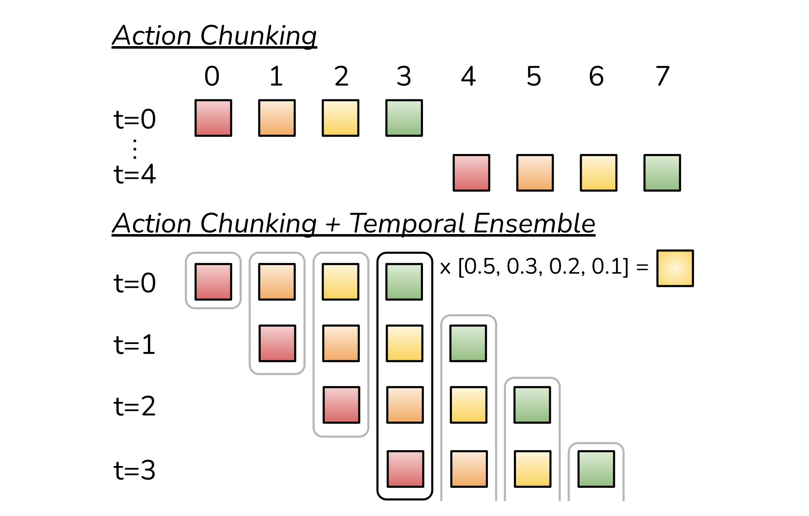
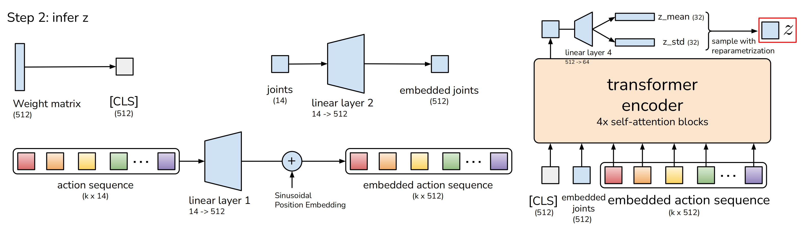
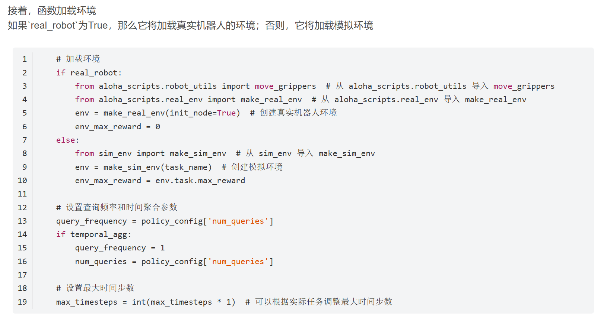
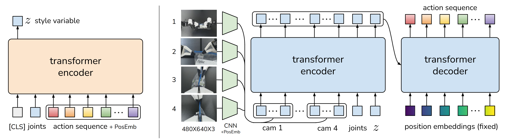

# Questions
what's the data form of action chunking and if it uses autoregression(自回归)  A：Yes！

finetune的时候 loss函数的标准与计算方法？ Tensor compute

CLS怎么来的，有什么作用？

finetune.py中可以使用use_diffusion来生成动作，目前主流的机械臂diffusion模型是什么？

有使用模拟物理环境吗？

# term 术语
 conditional variational autoencoder (CVAE)
 
 通过上一小节，可知CVAE 编码器的输入目前包括了

[CLS]token，它由随机初始化的学习权值组成
嵌入关节位置embedded joints
通过一个线性层linear layer2，把joints投影到嵌入维度的关节位置(14维到512维)，得到：embedded joints
嵌入动作序列embedded action sequence
通过另一个线性层linear layer1，把k × 14的action sequence投影到嵌入维度的动作序列(k × 14维到k × 512维)

joints 被添加了两次（第一次用于生成 Z ）

数据集的采集方法与过程
